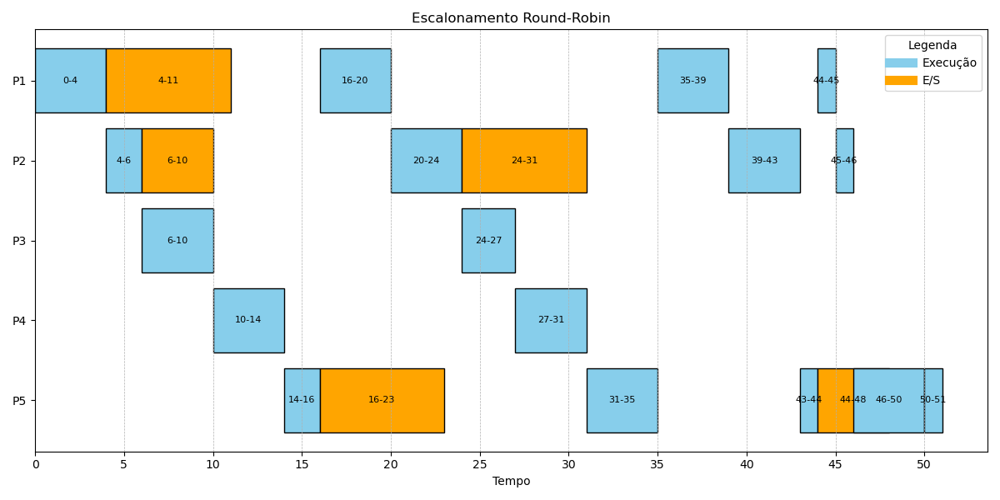

# Exercício de Escalonamento de Processos

**Nome**: Murilo Aldigueri Marino

## Introdução

Considere o seguinte conjunto de processos:

| Processo | Tempo de Execução | Instante de Ativação | Instante de Tempo para E/S(*) | Tipo de Operação de E/S |
| -------- | ----------------- | -------------------- | ----------------------------- | ----------------------- |
| P1       | 13                | 0                    | 4                             | A                       |
| P2       | 11                | 4                    | 2,6                           | B, A                    |
| P3       | 7                 | 5                    | ---                           | ---                     |
| P4       | 8                 | 7                    | ---                           | ---                     |
| P5       | 12                | 8                    | 2,7                           | A, B                    |

(*) A partir do início da execução do processo.

Os processos são criados na ordem **P1**, **P2**, **P3**, **P4** e **P5**. As operações de E/S do tipo **A** consomem 7 unidades de tempo, e do tipo **B** consomem 4 unidades de tempo.

### Objetivo

Apresentar o gráfico de execução dos processos para os algoritmos de escalonamento **FIFO** (First-Come, First-Served) e **Round-Robin** (com Quantum = 4), e calcular o **turnaround** de cada processo para cada um desses algoritmos.

## Resposta

### Gráfico de Execução para o Algoritmo FIFO

Para o algoritmo **FIFO**, os processos são executados na ordem de chegada, e as operações de E/S são respeitadas. O gráfico abaixo ilustra o processo de execução para cada um dos processos:

### Turnaround para o Algoritmo FIFO

O **turnaround** de um processo é o tempo total que ele leva para ser concluído, desde o momento em que entra no sistema até o momento em que é totalmente executado. A fórmula para calcular o turnaround é:

$$
\text{Turnaround} = \text{Tempo de término} - \text{Tempo de ativação}
$$

| Processo | Tempo de Ativação | Tempo de Fim |
| -------- | ----------------- | ------------ |
| P1       | X1                | X1 - 0       |
| P2       | X2                | X2 - 4       |
| P3       | X3                | X3 - 5       |
| P4       | X4                | X4 - 7       |
| P5       | X5                | X5 - 8       |

#### Cálculos

- **P1**: $ \text{Turnaround}_{P1} = X1 - 0 $
- **P2**: $ \text{Turnaround}_{P2} = X2 - 4 $
- **P3**: $ \text{Turnaround}_{P3} = X3 - 5 $
- **P4**: $ \text{Turnaround}_{P4} = X4 - 7 $
- **P5**: $ \text{Turnaround}_{P5} = X5 - 8 $

---

### Gráfico de Execução para o Algoritmo Round-Robin (Quantum = 4)

No algoritmo **Round-Robin**, o tempo de execução de cada processo é limitado por um quantum de 4 unidades de tempo. Os processos são interrompidos a cada 4 unidades de tempo, e as operações de E/S também são respeitadas.

### Turnaround para o Algoritmo Round-Robin

Para o algoritmo **Round-Robin**, a fórmula para calcular o turnaround é a mesma:

$$
\text{Turnaround} = \text{Tempo de término} - \text{Tempo de ativação}
$$

| Processo | Tempo de Ativação | Tempo de Fim |
| -------- | ----------------- | ------------ |
| P1       | X1                | X1 - 0       |
| P2       | X2                | X2 - 4       |
| P3       | X3                | X3 - 5       |
| P4       | X4                | X4 - 7       |
| P5       | X5                | X5 - 8       |

#### Cálculos

- **P1**: $ \text{Turnaround}_{P1} = Y1 - 0 $
- **P2**: $ \text{Turnaround}_{P2} = Y2 - 4 $
- **P3**: $ \text{Turnaround}_{P3} = Y3 - 5 $
- **P4**: $ \text{Turnaround}_{P4} = Y4 - 7 $
- **P5**: $ \text{Turnaround}_{P5} = Y5 - 8 $

---
